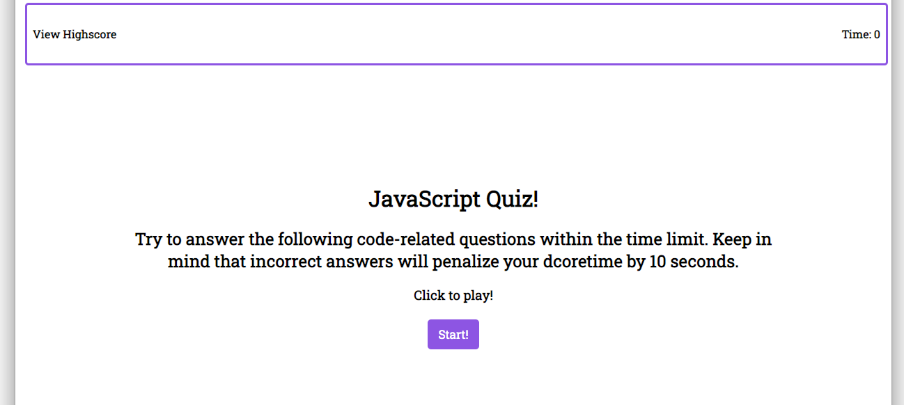
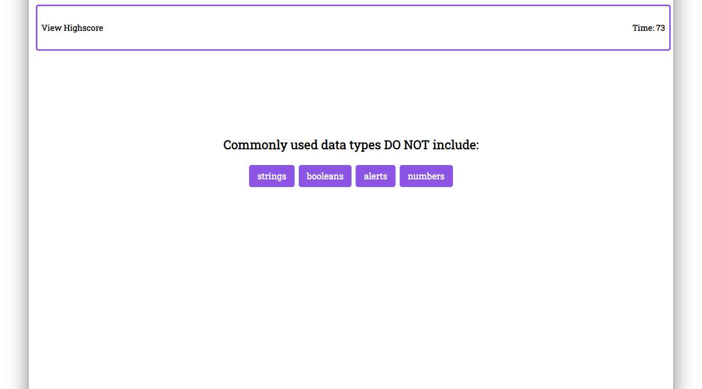
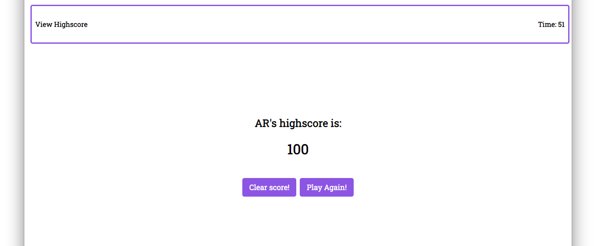
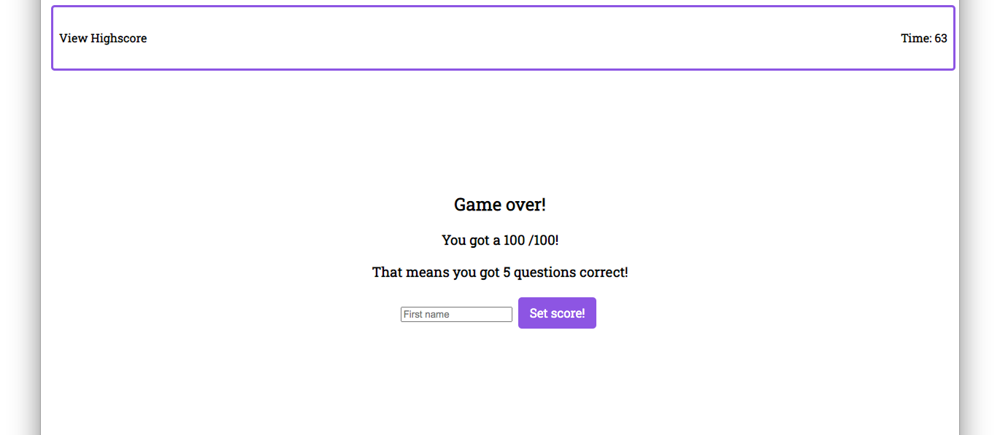

JavaScript Code Quiz

Live Link: 

The Goal - take a timed quiz on JavaScript fundamentals that stores high scores
so that the user can gauge there progress.

This is a quiz application using HTML, CSS, and Javascript. This application emphasizes the use of Javascript to provide quiz questions and collect user data to determine whether the answers to a question are correct, this then generates a score and appends a final page of results from the user data.

Summary
HTML and CSS and Javascript documents create a quiz with multiple choice questions with Javascript trivia
This project emphasizes the use of using Javascript to make dynamic changes to an HMTL document

This project has the following features:
Starter button to activate timer
Multiple choice questions including hover over feature with clickable effect. 
Includes a banner at the top of the page that includes the Highscore and also the active timer. 

Screenshots below show the progress of the quiz and timer feature. 

Homescreen:

Frist Question:

End Quiz Page:

Game Over Page:
